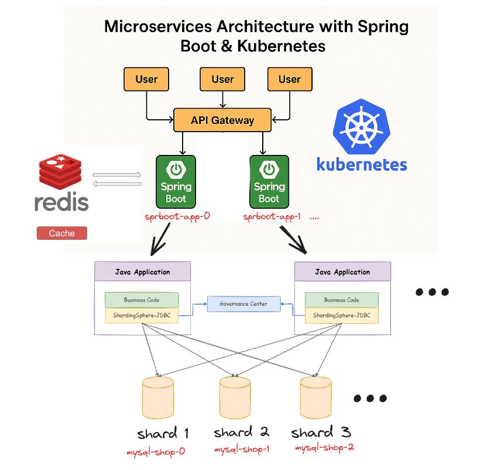
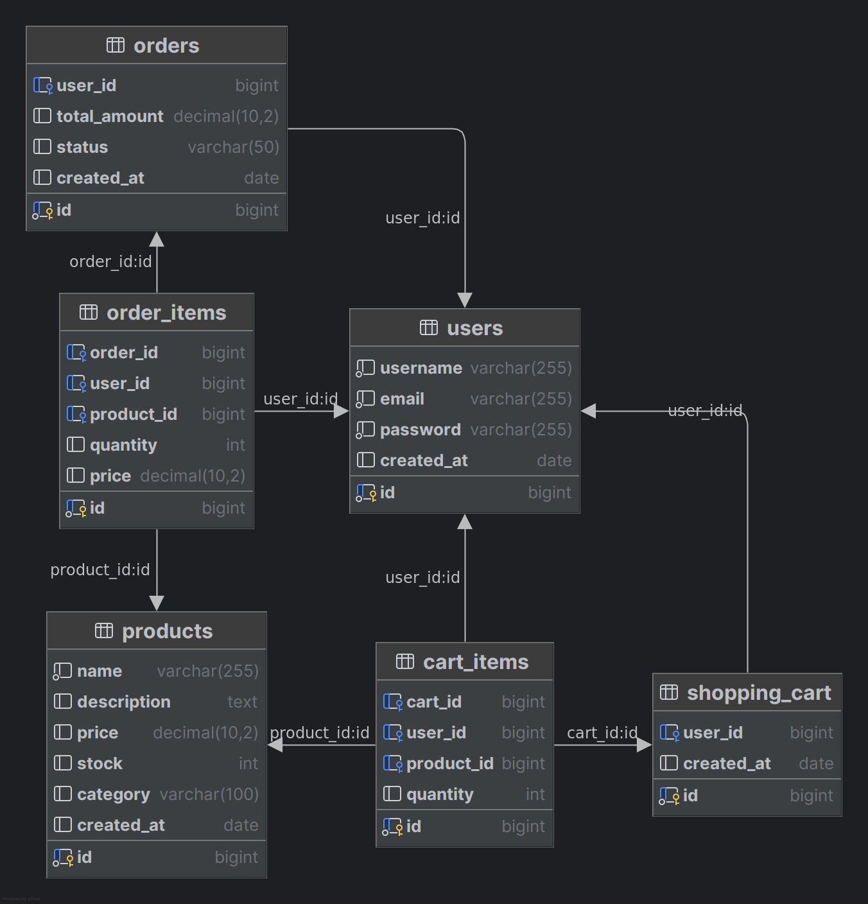

# 🛒 E-Commerce Microservice Backend

A cloud-native, horizontally scalable e-commerce platform built with **Spring Boot**, **MySQL (sharded via ShardingSphere-JDBC)**, and **Redis**. The entire stack is containerized with **Docker** and orchestrated using **Kubernetes**, featuring `StatefulSets`, `Secrets`, and internal service discovery.

This system supports:

- ✅ CRUD operations
- ✅ Redis-based caching
- ✅ Horizontal sharding across multiple **MySQL databases** using Apache ShardingSphere-JDBC
- ✅ Multiple Spring Boot replicas for scalability, load balancing, and resilience
- ✅ Kubernetes-ready deployment with persistent storage (PVC), internal services, and scaling capabilities

The architecture is designed to reflect real-world production concerns such as database sharding, distributed caching, 
and fault-tolerant container orchestration, with full support for distributed data management.

<h2 align="center">Demo Videos</h2>

  <a href="https://youtu.be/ejNyYhkfvEg" target="_blank">
    ▶️ Part 1: Spring Boot + Sharding
  </a>

  <a href="https://youtu.be/5uDGl8WH9Zw" target="_blank">
    ▶️ Part 2: Kubernetes Deployment and Scaling
  </a>

---

<h2 align="center">System Architecture</h2>

  

<h2 align="center">Sharded Database Design</h2>

  

## 📦 Tech Stack

- **Backend**: Spring Boot 3
- **Database**: MySQL 8 (sharded across replicas using Apache ShardingSphere)
- **Caching**: Redis (global)
- **Containerization**: Docker
- **Orchestration**: Kubernetes
- **Sharding Strategy**:
    - Horizontal database sharding by `user_id`
    - Binding tables for cart and order item relationships
    - Broadcast tables for shared reference data (e.g., products)
    - Snowflake algorithm for distributed unique ID generation
- **Containerization**: Docker
- **Orchestration**: Kubernetes
    - Deployments with replicas
    - StatefulSets for MySQL
    - Secrets, ConfigMaps, Services for environment configuration